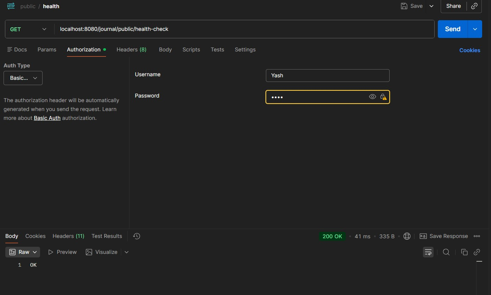
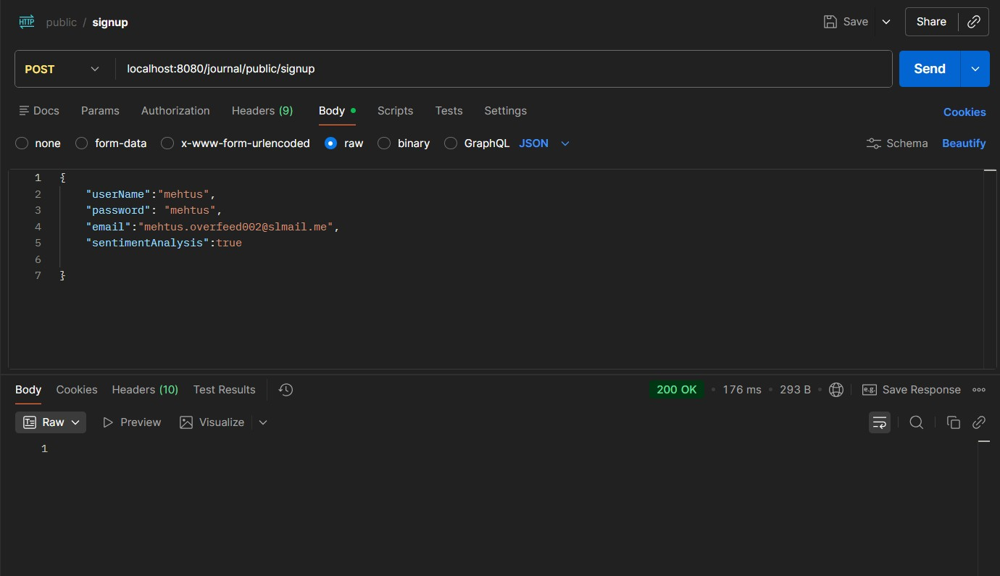
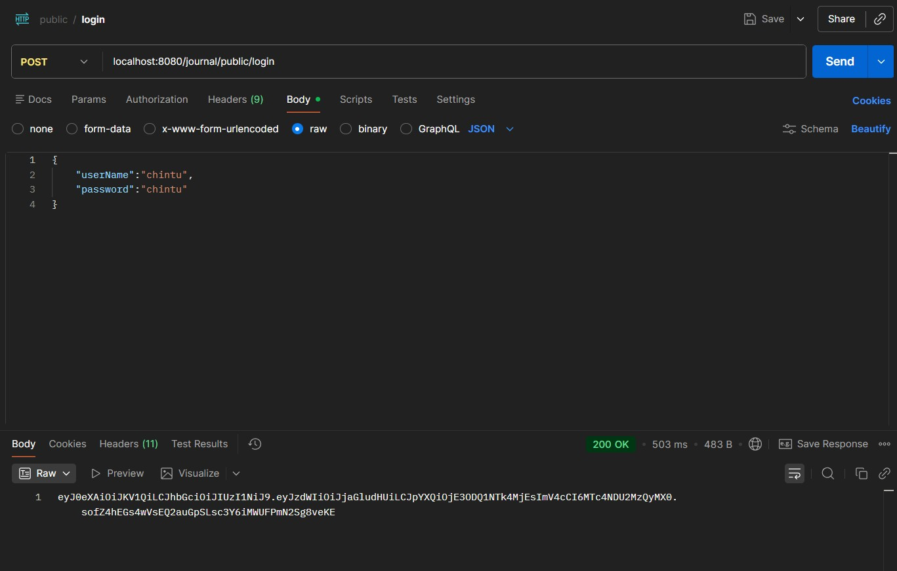
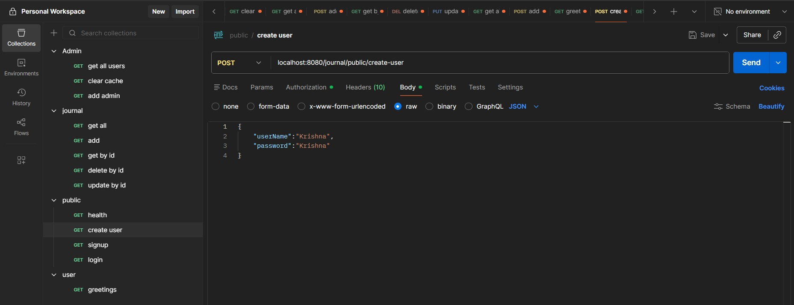
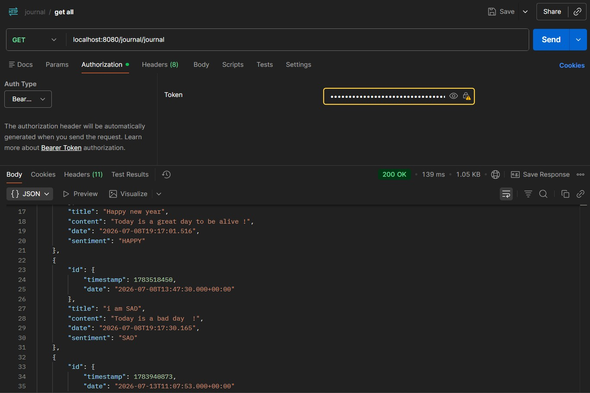
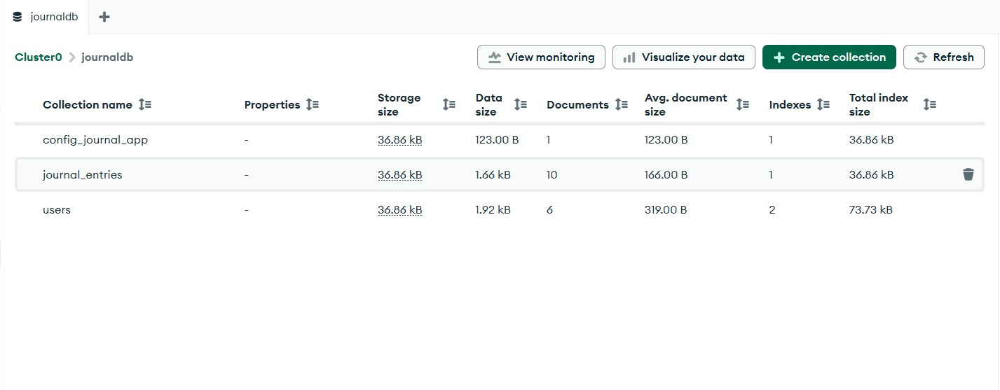
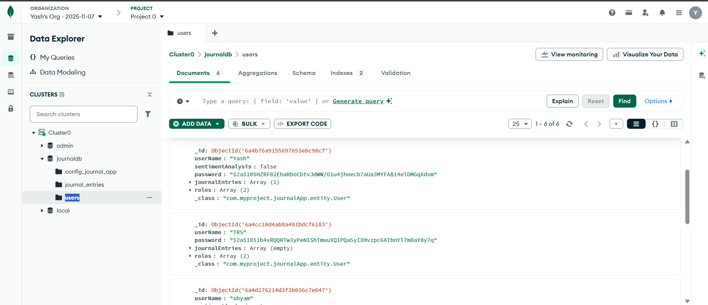
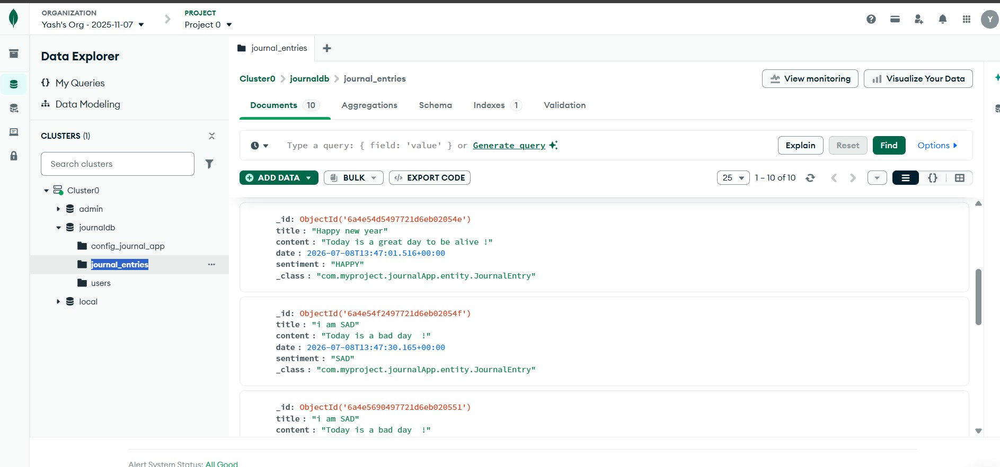
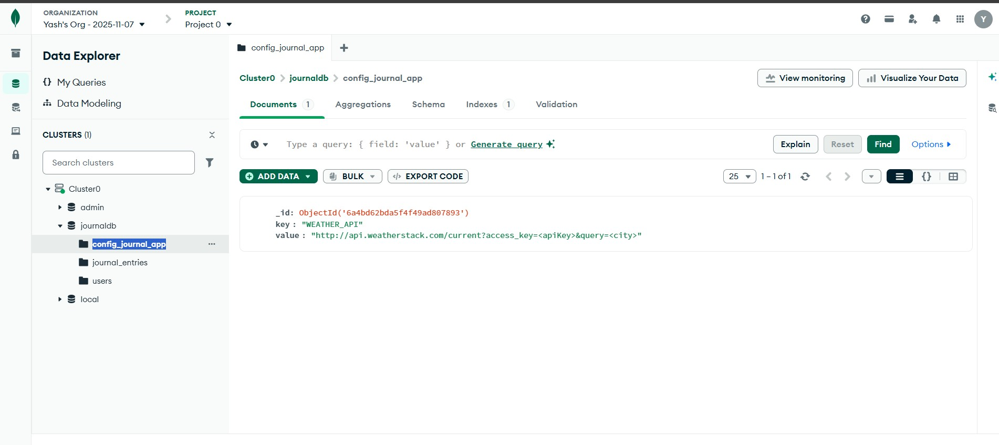

# 📒 Journal Application

A secure RESTful Journal Management Application developed using **Spring Boot**, **Spring Security**, **JWT Authentication**, and **MongoDB Atlas**. The application enables users to register, authenticate, and manage personal journal entries securely.

---

##  Features

- User Registration & Login
- JWT Authentication
- Spring Security
- Role-Based Authorization
- CRUD Operations on Journal Entries
- MongoDB Atlas Integration
- BCrypt Password Encryption
- Weather API Integration
- Health Check API
- Environment Variable Configuration
- RESTful APIs
- Postman API Testing

---

##  Tech Stack

| Technology | Version |
|------------|----------|
| Java | 21 |
| Spring Boot | 3.x |
| Spring Security | Latest |
| JWT | JJWT |
| MongoDB Atlas | Cloud Database |
| Maven | Build Tool |
| Postman | API Testing |
| Git | Version Control |
| GitHub | Repository Hosting |

---

# Project Architecture

Controller

↓

Service

↓

Repository

↓

MongoDB Atlas

---

##  Project Structure

src
├── controller
├── service
├── repository
├── entity
├── dto
├── config
├── filter
├── util
├── cache
├── scheduler
└── exception

---

##  Authentication

This project uses

- Spring Security
- JWT Token Authentication
- BCrypt Password Encoder

Workflow

User Login

↓

JWT Generated

↓

JWT Sent in Authorization Header

↓

Protected APIs Accessed

---

# API Endpoints

## Public APIs

| Method | Endpoint | Description |
|----------|---------------------------|----------------|
| GET | /public/health-check | Health Check |
| POST | /public/signup | Register User |
| POST | /public/login | Login User |
| POST | /public/create-user | Create User |

---

## Journal APIs

| Method | Endpoint |
|----------|----------------|
| GET | /journal |
| POST | /journal |
| GET | /journal/id/{id} |
| PUT | /journal/id/{id} |
| DELETE | /journal/id/{id} |

---

# MongoDB Collections

users

Stores

- Username
- Password
- Roles
- Journal References

journal_entries

Stores

- Title
- Content
- Date
- Sentiment

config_journal_app

Stores

- Weather API Configuration

---

# ▶ How to Run

## Clone Repository

git clone https://github.com/YourUsername/Journal-App.git

---

## Go to Project

cd Journal-App

---

## Build

mvn clean install

---

## Run

mvn spring-boot:run

---

Server Starts At

http://localhost:8080

---

# 🔑 Login

POST

/public/login

Returns

JWT Token

Use the token in

Authorization

Bearer <JWT Token>

---

#  Screenshots

## Health Check API

---

## Signup API

---

## Login API

---

## Create User API

---

## Get All Journal Entries

---

## MongoDB Collections

---

## Users Collection

---

## Journal Entries Collection

---

## Config Collection

---

# 🔮 Future Improvements

- Docker Support
- Redis Cache
- Kafka Integration
- Email Verification
- Swagger Documentation
- Unit Testing
- CI/CD Pipeline
- Kubernetes Deployment

---

#  Author

Yash Bhardwaj

